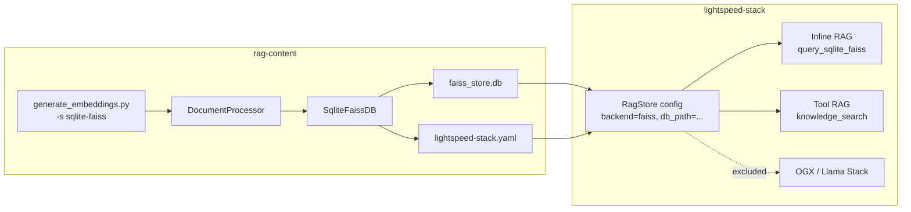
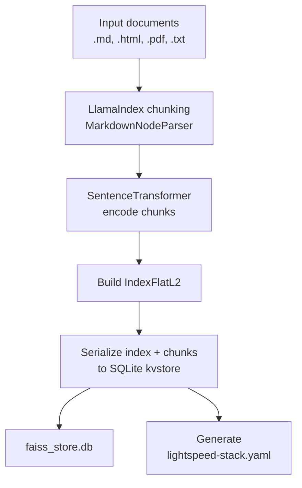
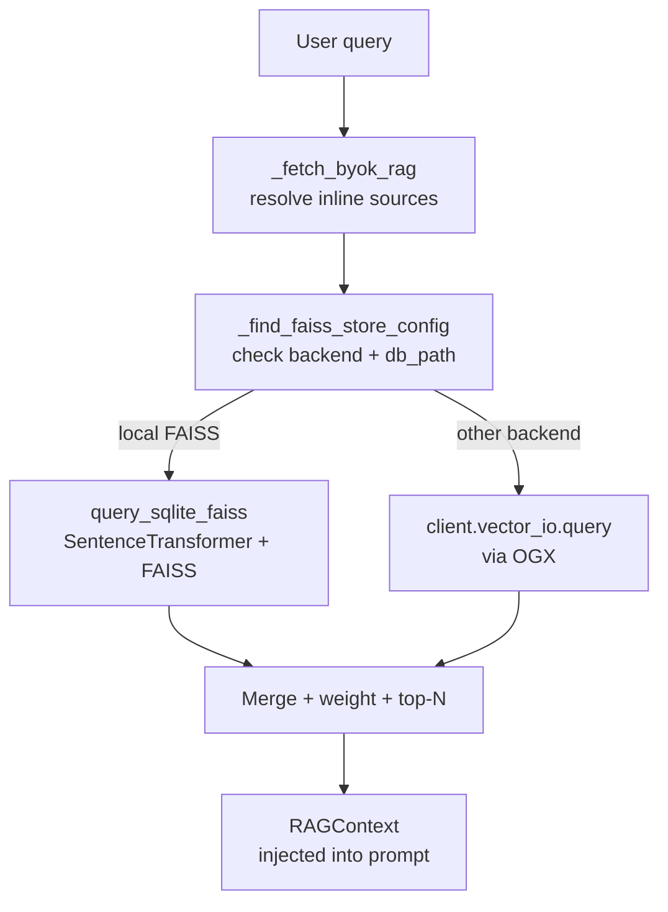
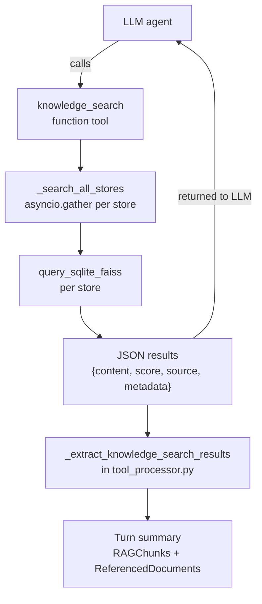

# Feature design: sqlite-faiss — OGX-free FAISS RAG

|                    |                                                         |
|--------------------|---------------------------------------------------------|
| **Date**           | 2026-08-29                                              |
| **Component**      | rag-content (write path), lightspeed-stack (serve path) |
| **Author**         | Sergey Yedrikov                                         |
| **Links**          | —                                                       |

## What

A self-contained FAISS RAG backend (`sqlite-faiss`) that writes and serves
vector stores using a SQLite kvstore file, with no runtime dependency on
OGX / Llama Stack for retrieval. The feature spans two repositories:

- **rag-content** produces `faiss_store.db` files during offline indexing.
- **lightspeed-stack** serves those files at query time for both inline
  and tool-based RAG, embedding queries locally via SentenceTransformer.

## Why

OGX (Llama Stack) is being removed as a dependency of lightspeed-stack.
The existing `llamastack-faiss` backend delegates all FAISS operations —
index registration, embedding, and query — to OGX, so it cannot survive
that removal. `sqlite-faiss` replaces that delegation with direct,
in-process FAISS and SentenceTransformer calls, reading the same SQLite
kvstore format that `llamastack-faiss` already writes. The on-disk layout
is unchanged; only the runtime path shifts from an OGX round-trip to a
local function call.

## Requirements

- **R1**: `rag-content` produces a `faiss_store.db` SQLite file and a
  `lightspeed-stack.yaml` config when invoked with `-s sqlite-faiss`.
- **R2**: The on-disk format is compatible with the historical
  `llamastack-faiss` kvstore layout (`vector_io::faiss:` key namespace,
  version `v3`), so existing tooling that reads these files continues to
  work.
- **R3**: `lightspeed-stack` serves `sqlite-faiss` stores for **inline
  RAG** by embedding queries with SentenceTransformer and searching the
  local FAISS index directly.
- **R4**: `lightspeed-stack` serves `sqlite-faiss` stores for **tool-based
  RAG** via a pydantic-ai function tool (`knowledge_search`) that the LLM
  can invoke explicitly.
- **R5**: Local FAISS stores are excluded from OGX configuration
  (`enrich_byok_rag`), from the native `file_search` tool
  (`prepare_tools`), and from OGX API calls in the REST `/rags` endpoints.
- **R6**: RAG chunks and referenced documents produced by
  `knowledge_search` are extracted into the turn summary for
  observability, following the same shape as OGX `file_search` results.
- **R7**: The Konflux integration test pipeline exercises both
  `llamastack-faiss` and `sqlite-faiss` across CPU, CUDA, and GPU matrix
  dimensions.

## Architecture

### Overview



### On-disk format

The `faiss_store.db` file is a SQLite database with a single `kvstore`
table:

```sql
CREATE TABLE kvstore (
    key        TEXT PRIMARY KEY,
    value      TEXT,
    expiration TIMESTAMP
);
```

Keys follow the namespace pattern `vector_io::faiss:{kind}:{version}::{vector_store_id}`:

| Kind | Value |
|------|-------|
| `faiss_index` | JSON object: `faiss_index` (base64-encoded numpy-serialized `IndexFlatL2`), `chunk_by_index` (map of stringified index to JSON chunk) |
| `vector_stores` | Store metadata |
| `openai_vector_stores` | OpenAI-compatible store metadata |
| `files` | File-level metadata |
| `contents` | Raw document contents |

This layout matches the historical `llamastack-faiss` / OGX v1.0 format
with namespace `vector_io::faiss` and version `v3`.

### Write path (rag-content)



**Key modules:**

| Module | Role |
|--------|------|
| `lightspeed_rag_content.sqlite_faiss.SqliteFaissDB` | Writer class; embeds with SentenceTransformer, builds `IndexFlatL2`, serializes to SQLite |
| `lightspeed_rag_content.sqlite_faiss.write_sqlite_faiss_store` | Low-level function that writes all kvstore entries for a single vector store |
| `lightspeed_rag_content.sqlite_faiss.manual_chunk_dicts` | Converts LlamaIndex nodes to OGX-shaped chunk dicts |
| `lightspeed_rag_content.sqlite_faiss.resolve_model_name_or_dir` | Resolves a model name to a local directory if one exists |
| `lightspeed_rag_content.config_templates.write_lcs_config_file` | Generates `lightspeed-stack.yaml` from base + BYOK templates |
| `lightspeed_rag_content.document_processor._SqliteFaissDB` | Mixin combining `SqliteFaissDB` (embed/save) with `_BaseDB` (chunking/config) |

**`SqliteFaissDB.save()` flow:**

1. Encode all chunks with `SentenceTransformer(model_name).encode(texts)`
2. Build `faiss.IndexFlatL2(dimension)` and add embeddings
3. Call `write_sqlite_faiss_store(...)` to persist index + metadata
4. Call `write_lcs_config(...)` to emit `lightspeed-stack.yaml`
5. Return `vs_{uuid}` as the vector store ID

**Distinction from `llamastack-faiss`:** The `llamastack-faiss` path
produces both a `faiss_store.db` and a `llama-stack.yaml` (OGX server
config). The `sqlite-faiss` path produces `faiss_store.db` and
`lightspeed-stack.yaml` only — no `llama-stack.yaml`, because OGX is not
involved.

### Serve path (lightspeed-stack)

#### Configuration

Local FAISS stores are configured via `RagStore` entries in the BYOK
config:

```yaml
rag:
  byok:
    stores:
      - rag_id: "my-knowledge"
        backend: faiss
        embedding_model: "BAAI/bge-base-en-v1.5"
        embedding_dimension: 768
        vector_db_id: "vs_abc123"
        db_path: "${env.RAG_DB_PATH:=/data/faiss_store.db}"
        score_multiplier: 1.0
  retrieval:
    inline:
      sources:
        - "my-knowledge"
    tool:
      sources:
        - "my-knowledge"
```

The `RagStore` model (in `src/models/config.py`) carries the fields that
matter for `sqlite-faiss`:

| Field | Role |
|-------|------|
| `rag_id` | User-facing identifier; used as `source` in search results |
| `backend` | Must be `"faiss"` for local stores |
| `db_path` | Path to the SQLite kvstore file; presence is the "locally served" signal throughout the codebase |
| `embedding_model` | SentenceTransformer model name or local path |
| `embedding_dimension` | Vector dimensionality |
| `vector_db_id` | Store ID inside the SQLite file |
| `score_multiplier` | Weight applied during inline RAG ranking |

**The local-FAISS predicate** used consistently across all modules is:
`backend == "faiss"` **and** `db_path` is set.

#### Inline RAG



In `src/utils/vector_search.py`:

- `_find_faiss_store_config(vector_store_id)` looks up the BYOK store
  by `vector_db_id`; returns it only when `backend == "faiss"` and
  `db_path` is set.
- `_query_store_for_byok_rag(...)` branches: if a local config is found,
  calls `query_sqlite_faiss(...)` directly; otherwise delegates to
  `client.vector_io.query(...)` via OGX.
- Results from both paths feed the same `_extract_byok_rag_chunks`
  pipeline: merge, apply `score_multiplier`, sort, truncate to top-N.

`query_sqlite_faiss` (in `src/utils/sqlite_faiss.py`) operates as follows:

1. Load or retrieve a cached `SentenceTransformer` model (async lock +
   `asyncio.to_thread`)
2. Encode the query string into an embedding
3. Open the SQLite file, deserialize the FAISS index, search for nearest
   neighbors
4. Convert L2 distances to similarity scores: `1 / (1 + distance)`
5. Filter by `score_threshold`, return `_SearchResponse(chunks, scores)`

#### Tool-based RAG



Tool-based RAG uses a dedicated pydantic-ai function tool:

1. **Capability registration**
   (`src/utils/pydantic_ai_helpers.py`):
   `_local_faiss_tool_stores(config)` identifies BYOK stores where
   `rag_id` is in `rag.retrieval.tool.sources`, `backend == "faiss"`,
   and `db_path` is set. If any are found, `build_agent` adds
   `SqliteFaissSearchCapability(stores=...)` to the agent's capabilities.

2. **Tool definition**
   (`src/pydantic_ai_lightspeed/capabilities/sqlite_faiss_search.py`):
   `SqliteFaissSearchCapability` creates a `FunctionToolset` with a
   single `@ts.tool_plain` function named `knowledge_search`. When the
   LLM invokes it:
   - `_search_all_stores` fires `query_sqlite_faiss` in parallel
     (`asyncio.gather`) across all configured local stores.
   - Failures are logged and skipped (graceful degradation).
   - Results are merged, sorted by score, truncated to `max_chunks`,
     and returned as a JSON string.

3. **OGX exclusion** (`src/utils/responses.py`):
   `prepare_tools` filters local FAISS `vector_db_id`s out of the
   native `file_search` tool definition using `_is_local_faiss_store`,
   so OGX never receives requests for stores it doesn't manage.

4. **Observability** (`src/utils/agents/tool_processor.py`):
   `process_function_tool_result` recognizes `knowledge_search` results
   and calls `_extract_knowledge_search_results` to parse the JSON,
   producing `RAGChunk` and `ReferencedDocument` entries for the turn
   summary. This ensures the same observability pipeline (OTEL spans,
   response metadata) works for local FAISS stores as for OGX-backed
   ones.

#### OGX configuration bypass

In `src/llama_stack_configuration.py`, `enrich_byok_rag` filters out
stores matching the local-FAISS predicate before injecting anything into
OGX configuration:

```python
ogx_byok_rag = [
    brag for brag in byok_rag
    if not (brag.get("backend") == "faiss" and brag.get("db_path"))
]
```

If no stores remain after filtering, OGX enrichment is skipped entirely
(only provider deduplication runs). This means a deployment with only
`sqlite-faiss` stores can start without a reachable OGX server for RAG.

#### REST `/rags` endpoints

In `src/app/endpoints/rags.py`:

- **List** (`GET /rags`): Collects `local_faiss_rag_ids` from config,
  lists OGX vector stores separately (gracefully returning `[]` on OGX
  failure), and merges both sets — local first.
- **Info** (`GET /rags/{rag_id}`): Checks for a local FAISS store first.
  If found, returns a synthetic `RAGInfoResponse` immediately
  (`status="completed"`, zero timestamps/bytes) without contacting OGX.
  Otherwise falls through to the OGX path.

### Integration testing

The Konflux integration test pipeline
(`.tekton/integration-tests/pipeline/rag-content-0-8-integration-test.yaml`)
exercises both vector store types across multiple dimensions:

| Task | Matrix |
|------|--------|
| `run-integration-test` | `PLATFORM` (amd64, arm64) x `RAG_CONTENT_IMAGE` (CPU, CUDA) x `VECTOR_STORE` (llamastack-faiss, sqlite-faiss) |
| `run-gpu-integration-test` | `VECTOR_STORE` (llamastack-faiss, sqlite-faiss) on a GPU VM |

`VECTOR_STORE` flows from the matrix parameter into the task step's `env`
block, then into the container via `PODMAN_ENV` (CPU tasks) or
`printf 'export ...'` (GPU tasks). The test script
(`tests/integration-konflux/pipeline-konflux.sh`) passes it to
`generate_embeddings.py -s "$VECTOR_STORE"` and asserts:

- Both store types produce `faiss_store.db` and `lightspeed-stack.yaml`
- `sqlite-faiss` does **not** produce `llama-stack.yaml`
- `llamastack-faiss` produces `llama-stack.yaml`

## Key files

### rag-content

| File | Role |
|------|------|
| `src/lightspeed_rag_content/sqlite_faiss.py` | Core module: `SqliteFaissDB`, `write_sqlite_faiss_store`, `search_sqlite_faiss_store`, `list_sqlite_faiss_vector_store_ids`, `resolve_model_name_or_dir`, `manual_chunk_dicts` |
| `src/lightspeed_rag_content/document_processor.py` | `_SqliteFaissDB` mixin, `_get_db` routing, `_check_config` warnings |
| `src/lightspeed_rag_content/config_templates.py` | `write_lcs_config_file`, `LCS_FAISS_BYOK_TEMPLATE` |
| `scripts/generate_embeddings.py` | CLI entry point (`-s sqlite-faiss`) |
| `tests/integration-konflux/pipeline-konflux.sh` | E2E test script using `VECTOR_STORE` env var |
| `.tekton/integration-tests/pipeline/rag-content-0-8-integration-test.yaml` | Tekton pipeline with matrix over vector store types |

### lightspeed-stack

| File | Role |
|------|------|
| `src/utils/sqlite_faiss.py` | Local FAISS retrieval: `query_sqlite_faiss`, `list_vector_store_ids`, embedding model cache |
| `src/pydantic_ai_lightspeed/capabilities/sqlite_faiss_search.py` | `SqliteFaissSearchCapability`, `_search_all_stores`, `knowledge_search` function tool |
| `src/utils/pydantic_ai_helpers.py` | `_local_faiss_tool_stores`, `build_agent` capability wiring |
| `src/utils/responses.py` | `_is_local_faiss_store`, `prepare_tools` filtering |
| `src/utils/agents/tool_processor.py` | `_extract_knowledge_search_results`, turn-summary integration |
| `src/utils/vector_search.py` | `_find_faiss_store_config`, inline RAG branching in `_query_store_for_byok_rag` |
| `src/llama_stack_configuration.py` | `enrich_byok_rag` local-FAISS filtering |
| `src/app/endpoints/rags.py` | `/rags` list/info endpoints with local-FAISS bypass |
| `src/models/config.py` | `RagStore` model with `backend`, `db_path`, `embedding_model` fields |

## Open questions for future work

- **Reranking for tool-based RAG**: The inline RAG path applies the
  cross-encoder reranker to local FAISS results (they flow through the
  same `rerank_chunks_with_cross_encoder` pool as all other BYOK
  chunks). The tool-based path (`knowledge_search`) sorts by raw FAISS
  similarity score only. Adding cross-encoder reranking to
  `_search_all_stores` would bring parity between the two paths.

## Changelog

| Date       | Change          | Reason         |
|------------|-----------------|----------------|
| 2026-08-29 | Initial version | Design capture |
